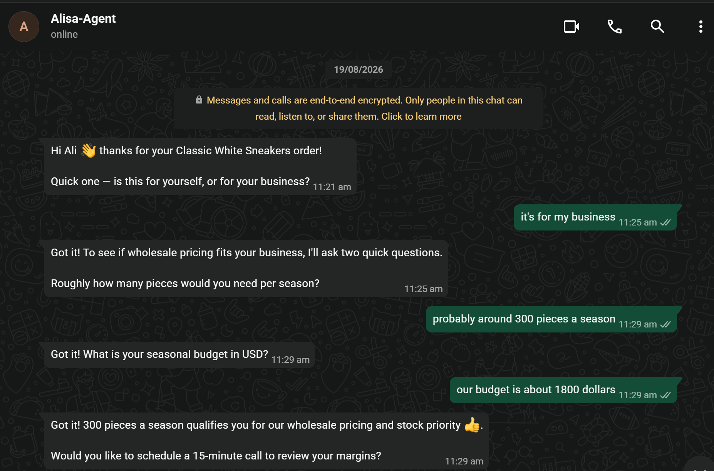
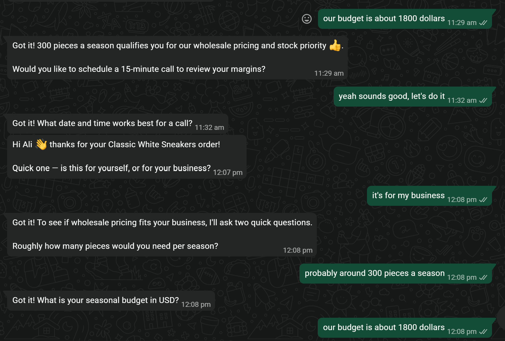
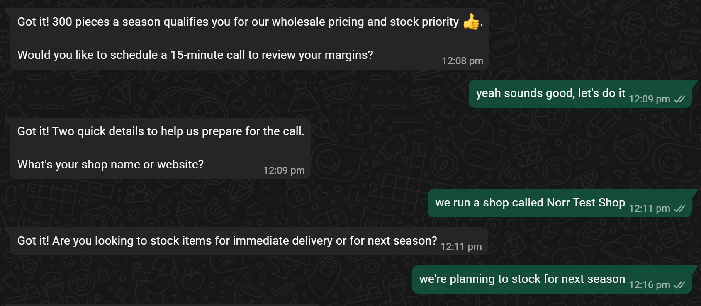
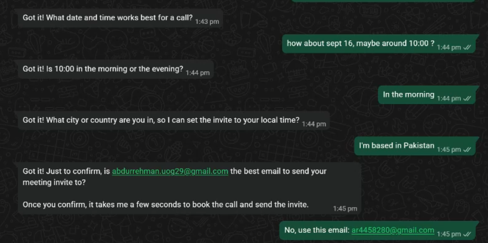
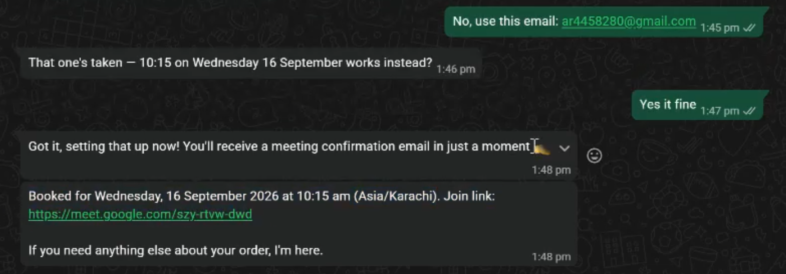
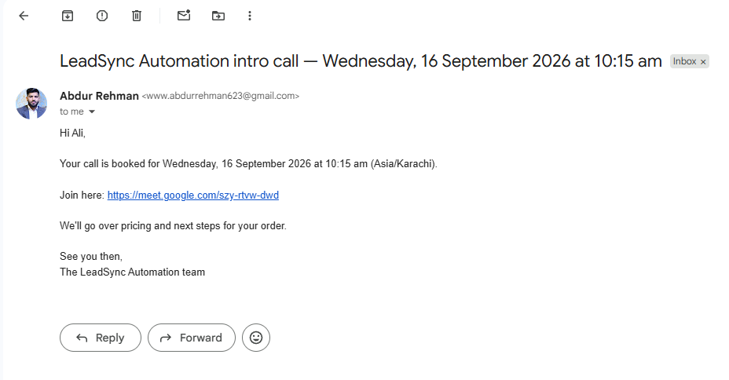
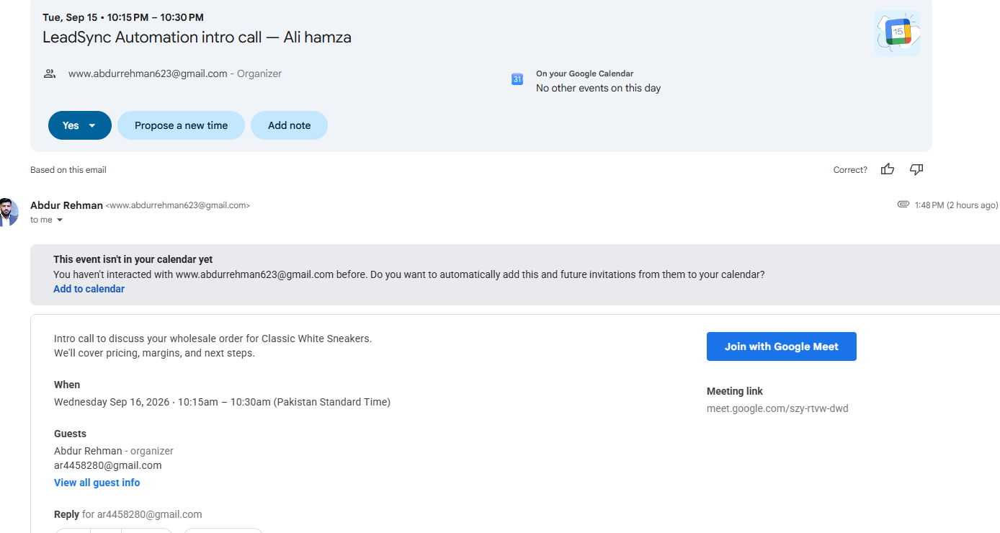
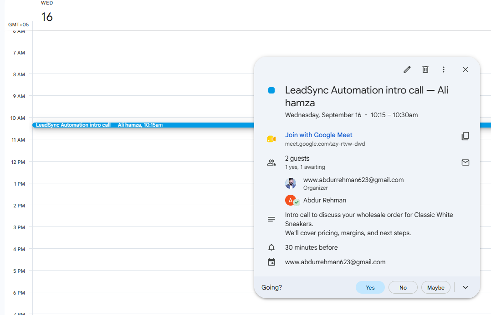
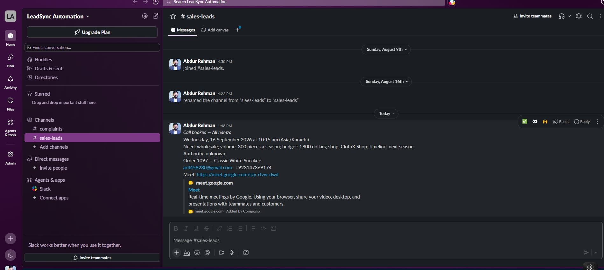
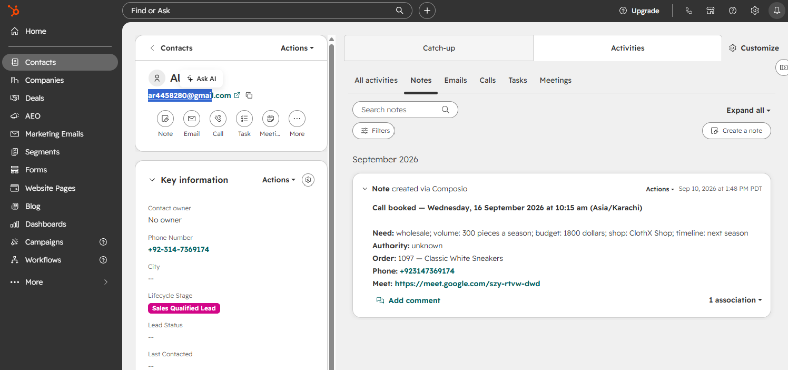

# Alisa — WhatsApp wholesale qualification agent

A WhatsApp agent that spots wholesale buyers in incoming Shopify orders, qualifies them
in conversation, and books a sales call — calendar invite, confirmation email, HubSpot
record and Slack notification included. Runs a 9B model locally, so there are no
per-message API costs.

Built for Norr Studio, a clothing brand.

---

## Agent in action

Screenshots from development and testing, shown in workflow order. These captures span multiple test runs, so some names and conversation details differ.

### 1. Identify buying intent

The agent asks whether the Shopify order is for personal use or a business.



### 2. Qualify the lead

The agent collects seasonal volume and budget. This capture also includes an earlier test before the pre-booking questions were fixed.



### 3. Offer a call and collect business details

After the customer accepts, the agent asks for the shop name and whether stock is needed immediately or next season.



### 4. Collect meeting details and confirm email

The agent clarifies the date, morning or evening, and timezone, then asks the customer to confirm or replace the invitation email.



### 5. Book the meeting

When the requested slot is unavailable, the agent offers another time. After acceptance, it shares the booking confirmation and Google Meet link.



### 6. Send the confirmation email

The customer receives an email containing the meeting time, timezone, and Google Meet link.



### 7. Deliver the calendar invitation

The invitation email includes the meeting details, guests, and Google Meet joining option.



### 8. Create the Google Calendar event

The scheduled call appears in Google Calendar with its meeting link and attendees.



### 9. Notify the sales team

A Slack notification includes the booked call, qualification details, order information, and meeting link.



### 10. Record the lead in HubSpot

The contact record includes a note with qualification details and the booked meeting.



---

## How it works

1. **Customer orders on Shopify.** Shopify POSTs to `/hooks/shopify`.
2. **A tunnel** (ngrok or Cloudflare Tunnel) forwards that public URL to `localhost:18790`.
3. **`intake_server.js`** receives it, verifies the HMAC signature, and does three things:
   - writes the lead file `~/.openclaw/workspace/leads/<phone>.md`
   - injects the `[ORDER INTAKE]` note into the OpenClaw WhatsApp session
   - sends the opening WhatsApp message
4. **The agent (Alisa)** takes over. `AGENTS.md` drives the conversation: intent → volume →
   budget → offer → shop → timeline → date/time → timezone → email.
5. **`book_meeting.js`** runs once via `exec`. It reads the lead file itself for name, email
   and order details, then calls ClawLink in fixed order: Google Calendar → Gmail →
   HubSpot → Slack `#sales-leads`.
6. **`escalate.js`** runs instead, at any point, if the customer complains, threatens legal
   action, demands a refund, or the booking fails twice. It posts to Slack `#complaints`
   and creates a HubSpot contact and note.

Escalation is not a final step. It is an **exit** available from any point, and it stops
the conversation permanently.

Everything runs on one machine, and it has to. Both scripts shell out to
`openclaw message send`, and both read the lead files from `~/.openclaw/workspace/leads`.

```
Shopify order
     │
     ▼
  tunnel  ──►  intake_server.js  ──►  lead file + opening WhatsApp message
                                              │
                                              ▼
                                      Alisa (AGENTS.md)
                                              │
                        ┌─────────────────────┴─────────────────────┐
                        ▼                                           ▼
                 book_meeting.js                              escalate.js
                        │                                           │
        Calendar → Gmail → HubSpot → Slack            Slack #complaints → HubSpot
```

---

## Files

| File | What it does |
|---|---|
| `AGENTS.md` | The agent's instructions — conversation flow, slots, booking steps, escalation triggers, hard limits. |
| `leadsync/intake_server.js` | Long-running web server on port 18790. Verifies the Shopify webhook, writes the lead file, sends the opening message. |
| `leadsync/book_meeting.js` | Run by the agent via `exec`. Books the call and completes the closeout across four services. |
| `leadsync/escalate.js` | Run by the agent via `exec`. Alerts a human on Slack and records the complaint in HubSpot. |
| `leadsync/README.md` | Notes on where lead files and integration credentials actually live. |
| `leads/` | One `<phone>.md` per customer. Written by intake, read by the other two. **Never committed.** |

Google Calendar, Gmail, HubSpot and Slack are **not** in this repo. All four run through
[ClawLink](https://claw-link.dev), authenticated with a single API key.

---

## Prerequisites

- **Node.js 18+** — the scripts use the built-in `fetch`
- **[Ollama](https://ollama.com)** with `qwen3.5:9b` pulled (~6.6 GB, needs ~8 GB free RAM)
- **OpenClaw** installed, with WhatsApp paired
- **A ClawLink account** with Google, HubSpot and Slack authorized
- **A Shopify store** with an `orders/create` webhook
- **A tunnel** — ngrok or Cloudflare Tunnel

---

## Configuration

### Environment variables

| Variable | Required | Notes |
|---|---|---|
| `SHOPIFY_WEBHOOK_SECRET` | **Yes** | From Shopify → Settings → Notifications → Webhooks. Without it, `intake_server` accepts unsigned requests from anyone. |
| `CLAWLINK_API_KEY` | Yes | Falls back to `~/.openclaw/openclaw.json` if unset. |
| `INTAKE_PORT` | No | Defaults to `18790`. |

### Model settings

In `~/.openclaw/openclaw.json`, under the `qwen3.5:9b` entry:

```json
"params": {
  "num_ctx": 16384,
  "num_predict": 2048,
  "keep_alive": "30m",
  "temperature": 0.2,
  "top_p": 0.9
}
```

`num_predict` matters. At the default 500 the model is cut off mid-reply on longer turns,
producing an unusable response and an error to the customer.

Configure a fallback model too — without one, a single malformed generation ends the
conversation with *"Agent couldn't generate a response."*

### Script paths

The two `exec` commands are hardcoded in `AGENTS.md`, lines **219** (booking) and **305**
(escalate). Move the scripts and you must update both lines.

---

## Running

Three processes, each in its own terminal. Start in this order.

**1. The agent gateway**

```
openclaw gateway restart
```

**2. The intake server**

```
node "%USERPROFILE%\.openclaw\workspace\leadsync\intake_server.js"
```

Expect:

```
intake server listening on http://localhost:18790/hooks/shopify
leads dir: C:\Users\<you>\.openclaw\workspace\leads
HMAC verification: ON
```

If it says `HMAC verification: OFF`, stop — `SHOPIFY_WEBHOOK_SECRET` is not set.

**3. The tunnel**

```
ngrok http 18790
```

Then point the Shopify webhook at `https://<your-url>/hooks/shopify`.

Reserve a static domain in the ngrok dashboard. On the free plan the URL changes on
restart, and Shopify will silently 404 until you update it.

---

## Verifying it works

Place a test order with 3+ items or $150+ total — either triggers the wholesale path.

- [ ] A lead file appears in `leads/`
- [ ] The opening WhatsApp message arrives
- [ ] A full conversation reaches a booking
- [ ] `exec` actually runs — check the log for `activeTool=exec`, not just a chat reply
- [ ] Calendar invite arrives at the right time in the right timezone
- [ ] The Meet link sent to the customer matches the calendar event
- [ ] HubSpot contact created with the budget number intact
- [ ] Slack `#sales-leads` notified

Escalation:

- [ ] Send a complaint. Expect an acknowledgement, a Slack post in `#complaints`, and the
      agent to stop replying permanently.

---

## Troubleshooting

Most failures are invisible in the WhatsApp transcript and obvious in the log. Keep this
open while testing:

```
openclaw logs --follow
```

| Symptom | Likely cause |
|---|---|
| Customer gets *"Agent couldn't generate a response"* | `stopReason=length` — `num_predict` too low, and no fallback model configured. |
| The agent replies normally but no meeting is booked | The model spent its turn on a message instead of the `exec` call. A turn holds one or the other. |
| Questions skipped | An instruction with "always" or "never" placed outside a step heading leaks into the section above it. |
| Repeat customer gets no opening message | Their lead file already exists — `intake_server` treats it as a duplicate webhook and skips. |
| `cannot find module` | A script path in `AGENTS.md` is stale. |
| Orders stop arriving | The tunnel URL changed, or Shopify removed the webhook after repeated failures. |

---

## Known limits

- **WhatsApp runs through an unofficial client.** Business volume on a personal number
  risks a ban. Production use should move to the WhatsApp Business API.
- **Single machine.** If it's off, conversations stall.
- **Repeat customers are skipped.** The duplicate-webhook guard keys on phone number with
  no expiry, so a returning customer never gets a second opening message.
- **Lead data is plaintext files**, not a database, and not encrypted.
- **One third-party dependency** — ClawLink fronts all four integrations.
- **Shopify retries a failed webhook 8 times over 4 hours**, then removes the subscription
  entirely. An extended outage loses orders silently.

---

## Security

- `leads/` holds real customer names, phones, emails and order values. It is gitignored.
  Never commit it.
- `openclaw.json` holds the ClawLink API key. Never commit it.
- `SHOPIFY_WEBHOOK_SECRET` must be set before the URL is public. Signature verification
  fails **open** — unset means every request is accepted.
